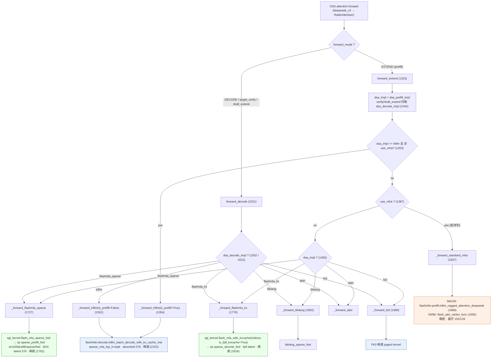
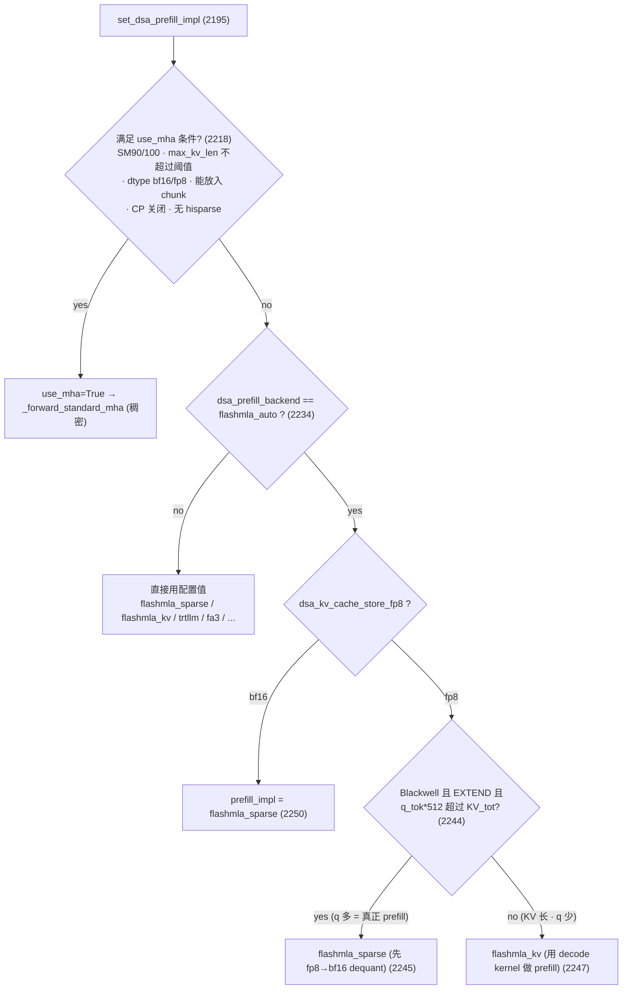
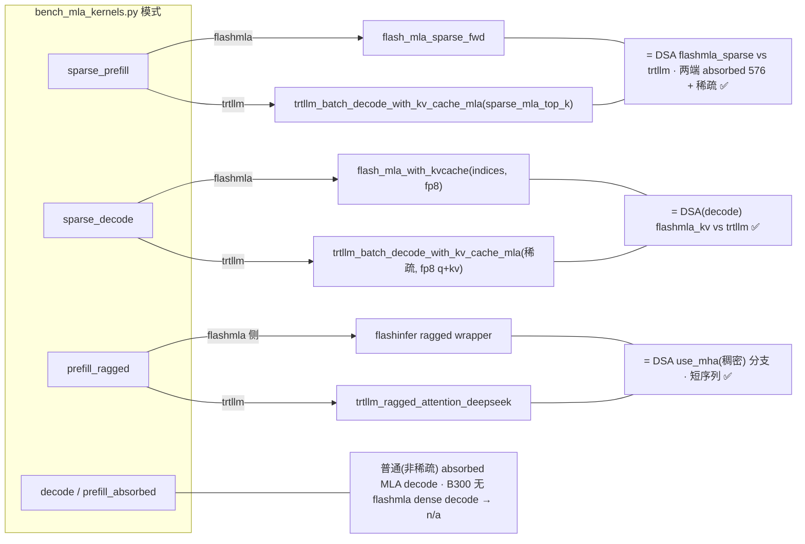

# 报告：SGLang DeepSeek V3.2（DSA）注意力后端调度逻辑

> 目的：厘清在 SGLang 中，DeepSeek **V3.2（DSA，稀疏注意力）** 的注意力前向到底走哪条
> 代码路径、调用哪个 kernel/API，并与 **V3（普通稠密 MLA）** 区分开。本报告给出**精确的
> 文件 / 函数 / 行号**，可逐条核对。
>
> 主要文件：`python/sglang/srt/layers/attention/dsa_backend.py`（下文若不特别注明，行号均指此文件）。
> 测试硬件背景：NVIDIA B300（Blackwell，SM 10.3）。比较对象：FlashMLA（`sgl_kernel`）与 trtllm-gen（`flashinfer`）。

---

## 1. 总览：三层结构

DSA 注意力调用分三层：

1. **调度层**（`dsa_backend.py`）：根据 `forward_mode`、`use_mha` 门控、以及 `dsa_*_impl`
   配置，决定走哪个 `_forward_*` 函数。**SGLang 自己的代码只到这一层**——它只负责"调用谁"。
2. **kernel/API 层**：被调用的实际算子。trtllm-gen 算子在 **flashinfer** 包里
   （`flashinfer.decode.* / flashinfer.prefill.*`）；FlashMLA 算子在 **sgl_kernel** 里
   （`sgl_kernel.flash_mla`）。
3. **cubin/源码层**：flashinfer 在运行时 JIT 下载/编译 trtllm-gen cubin；FlashMLA 由
   `sgl-kernel/cmake/flashmla.cmake` 从 `sgl-project/FlashMLA` 源码编译。

---

## 2. 调度入口与分支

### 2.1 Prefill：`forward_extend`（def 在 `dsa_backend.py:1323`）

| 步骤 | 行号 | 说明 |
|------|------|------|
| 选择实现 | `1344–1351` | `dsa_impl = dsa_decode_impl`（当 `is_target_verify()` 或 `is_draft_extend()`）`else dsa_prefill_impl` |
| trtllm 分支 | `1353` | `if dsa_impl == "trtllm" and not self.use_mha:` → 调 `_forward_trtllm(..., is_prefill=True)`（`1354`） |
| use_mha 分支 | `1387` | `if self.use_mha:` → 调 `_forward_standard_mha`（`1393`） |
| tilelang | `1455` | `if dsa_impl == "tilelang":` → `_forward_tilelang` |
| **flashmla_sparse** | `1465` | `elif dsa_impl == "flashmla_sparse":` → `_forward_flashmla_sparse`（`1482`） |
| **flashmla_kv** | `1489` | `elif dsa_impl == "flashmla_kv":` → `_forward_flashmla_kv`（`1492`） |
| fa3 | `1502` | `elif dsa_impl == "fa3":` → `_forward_fa3` |
| aiter | `1517` | `elif dsa_impl == "aiter":` → `_forward_aiter` |

### 2.2 Decode：`forward_decode`（def 在 `dsa_backend.py:1531`）

| 分支 | 行号 | 调用 |
|------|------|------|
| trtllm | `1552` | `if self.dsa_decode_impl == "trtllm":` → `_forward_trtllm(..., is_prefill=False)` |
| flashmla_sparse | `1622` | → `_forward_flashmla_sparse` |
| flashmla_kv | `1632` | → `_forward_flashmla_kv` |
| tilelang | `1645` | → `_forward_tilelang` |
| fa3 | `1659` | → `_forward_fa3` |
| aiter | `1674` | → `_forward_aiter` |

> 注意：`_forward_trtllm`、`_forward_flashmla_sparse`、`_forward_flashmla_kv` 都被
> **prefill 与 decode 共用**；prefill 与 decode 的差别只在 `is_prefill` 标志和 page table 的
> 变换方式，**kernel 本身相同**。

---

## 3. use_mha 门控（稠密短序列分支）

`use_mha` 在 `set_dsa_prefill_impl`（def `2195`）里设定，条件见 `2218–2229`：

- SM90 或 SM100（`device_sm == 90 or 100 ≤ device_sm < 110`）
- `max_kv_len ≤ SGLANG_DSA_PREFILL_DENSE_ATTN_KV_LEN_THRESHOLD`（**短序列**）
- KV dtype ∈ {bf16, fp8}
- `sum_seq_lens ≤ get_max_chunk_capacity()`（放得进 chunk）
- 未开启 prefill context parallel
- 无 hisparse coordinator

满足时 `use_mha=True`，prefill 走 `_forward_standard_mha`（**稠密 MHA / 展开**）；
decode/verify 恒为 `use_mha=False`（`2231`）。**长上下文（如 90k+10k）不满足短序列条件 →
走稀疏分支，而非此稠密分支。**

---

## 4. prefill 实现的自动选择启发式

仅当 `dsa_prefill_backend == "flashmla_auto"` 时启用（`enable_auto_select_prefill_impl`，
定义于 `335`）。逻辑见 `set_dsa_prefill_impl`，`2234–2250`：

```
if not use_mha and enable_auto_select_prefill_impl:        # 2234
    if dsa_kv_cache_store_fp8:                              # 2235  (fp8 KV)
        if is_blackwell() and forward_mode == EXTEND:       # 2237-2239
            if total_kv_tokens < total_q_tokens * 512:       # 2244
                dsa_prefill_impl = "flashmla_sparse"; return # 2245
        dsa_prefill_impl = "flashmla_kv"                    # 2247
    else:                                                   # bf16 KV
        dsa_prefill_impl = "flashmla_sparse"                # 2250
```

结论：
- **bf16 KV** → 恒为 `flashmla_sparse`（专用稀疏 prefill kernel）。
- **fp8 KV** 且 `KV_tot < q_tok × 512`（q 多 = 真正 prefill）→ `flashmla_sparse`（但需先把 fp8 dequant 回 bf16）。
- **fp8 KV** 且 `KV_tot ≥ q_tok × 512`（KV 很长、q 很少，接近 decode）→ `flashmla_kv`（**用 decode kernel 做 prefill**）。

> 例：90k cached + 10k new → `total_kv=100000`，`total_q=10000`，`q_tok×512=5,120,000`，
> `100000 < 5,120,000` 成立 → `flashmla_sparse`。

---

## 5. 各后端实际调用的 kernel / API

### 5.1 trtllm —— `_forward_trtllm`（def `2046`）
- API：`flashinfer.decode.trtllm_batch_decode_with_kv_cache_mla(...)`（调用点 `2152`）。
- 关键参数：`query`（absorbed，head_dim 576）、`kv_cache`（latent 576，**不展开**）、
  `sparse_mla_top_k=self.dsa_index_topk`（**稀疏**，只 attend topk）、`backend="trtllm-gen"`。
- fp8 路径：先用 `mla_quantize_and_rope_for_fp8(...)` 把 **query 也量化成 fp8**（`2079`）；
  `is_prefill` 只改变 page table 的变换方式（`2122–2134`），kernel 与 decode 相同。

### 5.2 flashmla_sparse —— `_forward_flashmla_sparse`（def `1727`）
- API：`sgl_kernel.flash_mla.flash_mla_sparse_fwd(...)`（调用点 `1762`）。
- 输入：q absorbed `(s_q, H_pad, 576)` **bf16**，kv latent `(s_kv, 1, 576)` **bf16**，
  indices `(s_q, 1, topk)`。head 数按 64/128 倍数 padding（`1742–1757`）。
- 这是 **专用稀疏 prefill kernel**（详见第 6 节 cmake 来源）。

### 5.3 flashmla_kv —— `_forward_flashmla_kv`（def `1776`）
- API：`sgl_kernel.flash_mla.flash_mla_with_kvcache(..., indices=..., is_fp8_kvcache=True)`（调用点 `1816`）。
- 输入：q bf16，KV 为 **fp8**（若未存 fp8 则用 `quantize_k_cache` 现量化，`1809`），latent 576。
- 这是 **稀疏 decode kernel**（被复用于 KV 长、q 少的 prefill）。

### 5.4 稠密 MHA —— `_forward_standard_mha`（def `1837`）
- SM100：`flashinfer.prefill.trtllm_ragged_attention_deepseek(...)`（`1868`）。
- SM90：`flash_attn_varlen_func(...)`（`1890`）。
- **稠密 + 展开**：q/k head_dim 完整、k/v 展开成普通多头（192/128），非 absorbed。

### 5.5 FlashMLA kernel 的编译来源 —— `sgl-kernel/cmake/flashmla.cmake`
- 源码仓库 `sgl-project/FlashMLA`，FetchContent（`2–7`）；SM100 在 CUDA>12.8 开启（`28–33`），
  CUDA≥13 打 SM103 补丁（`34–87`）。
- **SM100 稀疏 prefill**：`csrc/sm100/prefill/sparse/fwd/head{64,128}/instantiations/phase1_k{512,576}.cu`（`128–133`）。
- **SM100 稀疏 decode**：`csrc/sm100/decode/head64/...`（`136–137`）+ head128 走
  `csrc/sm100/prefill/sparse/fwd_for_small_topk/head128/.../phase1_decode_k512.cu`（`138`）。
- **SM100 无稠密 decode 源**（只有 sm90，`101–102`）→ B300 上稠密 decode 缺失（`n/a`）。

> 即：`flash_mla_sparse_fwd`（→ op `sparse_prefill_fwd`）与 `flash_mla_with_kvcache(indices)`
> （→ op `sparse_decode_fwd`）是**两个不同的 op / 不同的 .cu kernel**，但同属一套稀疏 FMHA 模板。
> op 映射见 `sgl-kernel/python/sgl_kernel/flash_mla.py`：`sparse_prefill_fwd`（`339`）、
> `sparse_decode_fwd`（`269`）。

---

## 6. V3 与 V3.2 的精确区分（关键，避免再次混淆）

| | V3（普通 MLA / 稠密） | V3.2（DSA / 稀疏） |
|---|---|---|
| 在 DSA 里的入口 | `_forward_standard_mha`（`use_mha` 分支，**仅短序列**） | `_forward_trtllm` / `_forward_flashmla_sparse` / `_forward_flashmla_kv` |
| trtllm API | `trtllm_ragged_attention_deepseek`（`1868`） | `trtllm_batch_decode_with_kv_cache_mla(sparse_mla_top_k)`（`2152`） |
| head 表示 | 展开 192 / 128 | absorbed latent 576 / 512 |
| 注意力 | 稠密（全 KV + 因果 mask） | 稀疏（只 attend topk=2048） |

要点：`trtllm_ragged_attention_deepseek` **不是"V3 专用"**，它在 DSA 里也用——但**只在
稠密 `use_mha` 分支**。长上下文稀疏路径的正确 trtllm API 是
`trtllm_batch_decode_with_kv_cache_mla(sparse_mla_top_k=...)`。

---

## 7. fp8 相关要点

1. **trtllm 的 fp8 KV dim 不 override**：`calculate_mla_kv_cache_dim`
   （`python/sglang/srt/model_executor/model_runner_kv_cache_mixin.py:182`）对 TRTLLM 后端
   返回 `kv_lora_rank + qk_rope_head_dim = 576`（`193–201`，注释 "excluding TRTLLM"），
   即 trtllm fp8 KV 是**平铺 576 fp8**，不是 FlashMLA `quantize_k_cache` 的 packed 布局
   （packed 公式见 `216–225`）。
2. **trtllm 要求 query dtype == KV dtype**：flashinfer 的 `trtllm_fmha_kernel_launcher.cu`
   断言 `kv_data_type == q_data_type`（均须 BF16 或 FP8 E4M3）。故 fp8 KV 必须配 fp8 query，
   否则 `Missing TRTLLM-GEN kernel`（派发未命中）。production 由
   `mla_quantize_and_rope_for_fp8`（`python/sglang/srt/layers/attention/utils.py:387`）把
   query 量化成 fp8（返回 `merged_q_out` 为 `float8_e4m3fn`）。

---

## 8. 本基准模式 ↔ DSA 实际路径映射

| 基准模式 | FlashMLA 侧 | trtllm 侧 | 对应 DSA 路径 |
|---|---|---|---|
| `sparse_prefill` | `flash_mla_sparse_fwd`（bf16 576 稀疏） | `trtllm_batch_decode_with_kv_cache_mla(sparse_mla_top_k)` | flashmla_sparse vs trtllm（prefill）✅ |
| `sparse_decode` | `flash_mla_with_kvcache(indices, fp8)` | `trtllm_batch_decode_with_kv_cache_mla(sparse, fp8 q+kv)` | flashmla_kv vs trtllm（decode）✅ |
| `prefill_ragged` | flashinfer ragged wrapper | `trtllm_ragged_attention_deepseek` | use_mha 稠密分支（短序列）✅ |
| `decode` / `prefill_absorbed` | dense absorbed MLA（B300 无 kernel → n/a） | trtllm decode | 普通（非稀疏）MLA decode |

---

## 9. 调用图（Mermaid）

### 9.1 主调度图



### 9.2 prefill_impl 自动选择启发式（set_dsa_prefill_impl, 2195–2250）



### 9.3 本基准模式 ↔ DSA 路径



---

## 10. 代码引用清单（file → function → line）

### `python/sglang/srt/layers/attention/dsa_backend.py`
| 函数 / 位置 | 行号 |
|---|---|
| `forward_extend`（prefill 入口） | def `1323` |
| dsa_impl 选择 | `1344–1351` |
| trtllm 分支（prefill） | `1353`（调用 `1354`） |
| use_mha 分支（prefill） | `1387`（调用 `1393`） |
| flashmla_sparse 分支（prefill） | `1465`（调用 `1482`） |
| flashmla_kv 分支（prefill） | `1489`（调用 `1492`） |
| `forward_decode`（decode 入口） | def `1531` |
| decode trtllm / flashmla_sparse / flashmla_kv | `1552 / 1622 / 1632` |
| `_forward_fa3` | def `1689` |
| `_forward_flashmla_sparse` | def `1727`；`flash_mla_sparse_fwd` 调用 `1762`；head padding `1742–1757` |
| `_forward_flashmla_kv` | def `1776`；`flash_mla_with_kvcache` 调用 `1816`；`quantize_k_cache` `1809` |
| `_forward_standard_mha` | def `1837`；`trtllm_ragged_attention_deepseek` `1868`；`flash_attn_varlen_func` `1890` |
| `_forward_tilelang` | def `1902` |
| `_forward_trtllm` | def `2046`；fp8 quantize `2079`；is_prefill page table `2122–2134`；`trtllm_batch_decode_with_kv_cache_mla` 调用 `2152` |
| `set_dsa_prefill_impl` | def `2195`；use_mha 条件 `2218–2229`；自动选择 `2234–2250` |
| 配置：`dsa_prefill_impl` / `dsa_decode_impl` / `enable_auto_select_prefill_impl` | `321 / 324 / 335` |

### `sgl-kernel/python/sgl_kernel/flash_mla.py`
| 内容 | 行号 |
|---|---|
| `get_mla_metadata` | def `41` |
| `flash_mla_with_kvcache` | def `87`；`fwd_kvcache_mla_fp8` `167`；`fwd_kvcache_mla` `181`；`sparse_decode_fwd` `269`；`dense_decode_fwd` `292` |
| `flash_mla_sparse_fwd`（docstring "Sparse attention prefill kernel" `320`） | def `310`；op `sparse_prefill_fwd` `339` |

### `sgl-kernel/cmake/flashmla.cmake`
| 内容 | 行号 |
|---|---|
| FetchContent `sgl-project/FlashMLA` | `2–7` |
| SM100 开启（CUDA>12.8）/ SM103 补丁（CUDA≥13） | `28–33 / 34–87` |
| sm90 稠密 decode 源 | `101–102` |
| sm90 稀疏 decode / 稀疏 prefill | `105–108 / 111–115` |
| SM100 稠密 prefill | `125–126` |
| SM100 稀疏 prefill | `128–133` |
| SM100 稀疏 decode（含 head128 走 fwd_for_small_topk） | `135–138` |

### 其它
| 内容 | 位置 |
|---|---|
| `calculate_mla_kv_cache_dim`（TRTLLM 不 override；fp8 packed 公式） | `python/sglang/srt/model_executor/model_runner_kv_cache_mixin.py:182`（`193–201` / `216–225`） |
| `mla_quantize_and_rope_for_fp8`（query 量化为 fp8） | `python/sglang/srt/layers/attention/utils.py:387` |
| trtllm 要求 `kv_data_type == q_data_type` | flashinfer `csrc/trtllm_fmha_kernel_launcher.cu`（外部包，运行时） |

---

## 11. 结论

1. **DSA（V3.2）的 trtllm 路径** = `_forward_trtllm`（`2046`）→
   `trtllm_batch_decode_with_kv_cache_mla(sparse_mla_top_k)`（`2152`），absorbed + 稀疏；
   **不是** `trtllm_ragged_attention_deepseek`（那是 `use_mha` 稠密分支）。
2. **DSA 的 FlashMLA prefill** = `flashmla_sparse`（`flash_mla_sparse_fwd`，bf16 latent）或
   `flashmla_kv`（`flash_mla_with_kvcache`，fp8），由启发式（`2234–2250`）按 KV dtype 与
   `KV_tot / q_tok` 比值选择。长上下文 bf16 → `flashmla_sparse`。
3. **`flash_mla_sparse_fwd` 确为 V3.2 DSA 专用稀疏 prefill kernel**（不同的 op `sparse_prefill_fwd`、
   不同的 `.cu`），并非把 V3 / decode 误当 prefill。
4. 本基准三个稀疏/稠密模式与上述 DSA 路径**一一对应**，可作为对 V3.2 的公平 kernel 对比。
